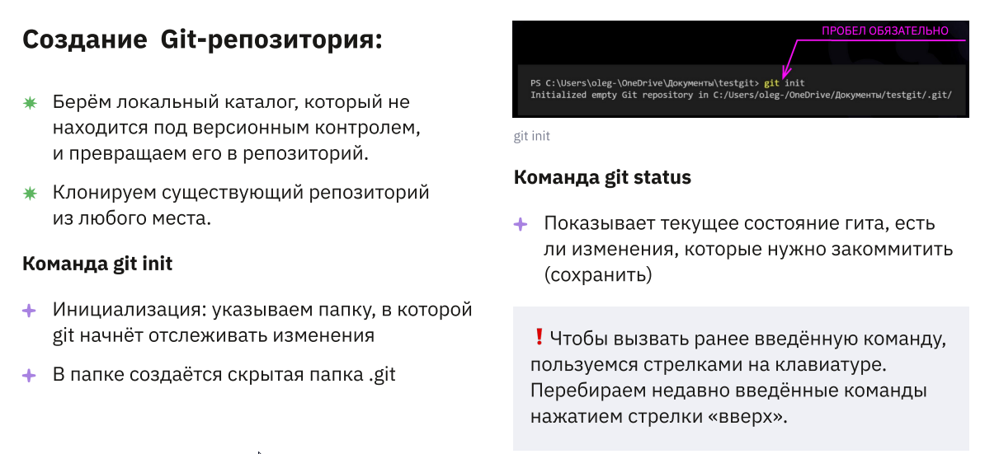

# Инструкция по работе с git

## Что это и для чего нужна система контроля версий?

Система контроля версий — это система, записывающая изменения в файл или набор файлов в течение времени и позволяющая вернуться позже к определённой версии. Для контроля версий файлов в этой книге в качестве примера будет использоваться исходный код программного обеспечения, хотя на самом деле вы можете использовать контроль версий практически для любых типов файлов.

### Что такое система контроля версий?

### Для чего нужна система контроля версий

## Установка git и VSCode на ваш ПК.
Скачать и установить:
гит - [https://git-scm.com/book/ru/v2/Введение-Установка-Git](https://git-scm.com/book/ru/v2/%D0%92%D0%B2%D0%B5%D0%B4%D0%B5%D0%BD%D0%B8%D0%B5-%D0%A3%D1%81%D1%82%D0%B0%D0%BD%D0%BE%D0%B2%D0%BA%D0%B0-Git)

vsc - [https://code.visualstudio.com/](https://code.visualstudio.com/)

сперва ставим первую (иногда нужна перезагрузка) потом второую

и прежде чем писать init - откройте какую-то папку в vsc и не используйте кириллицу в путях 

### Установка VSCode на ваш ПК.

### Установка git на ваш ПК
* **Git для Windows,Mac,Linux:**  [https://git-scm.com/downloads](https://git-scm.com/downloads)

    При первом использовании Git необходимо представитсься. Для этого нужно ввести в терминал команды:

    1. git config --global user.name "Ваше имя английскими буквами" git

    2. config -- global user.email ваша_почта@example.com

#### Первая настройка git

## Создание и базовая работа с локальным репозиторием.

### Что такое репозиторий и инструкция по созданию локальных репозиториев.

### Базовая работа с локальным репозиторием

## Ветки. Локальная работа с ветками в git.

### Что такое ветки и для чего они нужны при работе с системой контроля версий.

### Базовая работа с ветками в git.

## Работа с удаленными репозиториями.

### Что такое удаленный репозиторий и для чего он нужен

### Базовая работа с удаленными репозиториями GitHub

## Совместная работа над проектом (fork, pull request)

### Как строится и для чего нужна совместная работа в системах контроля версий

### Инструкция по созданию pull request

## Книги и полезные ссылки по изучению git.

## Альтернативные системы контроля версий.
